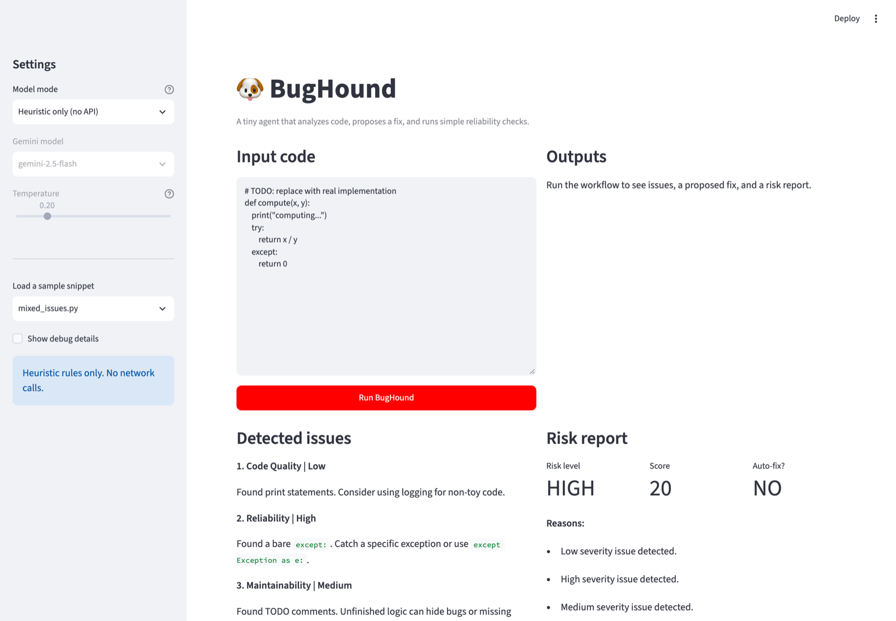
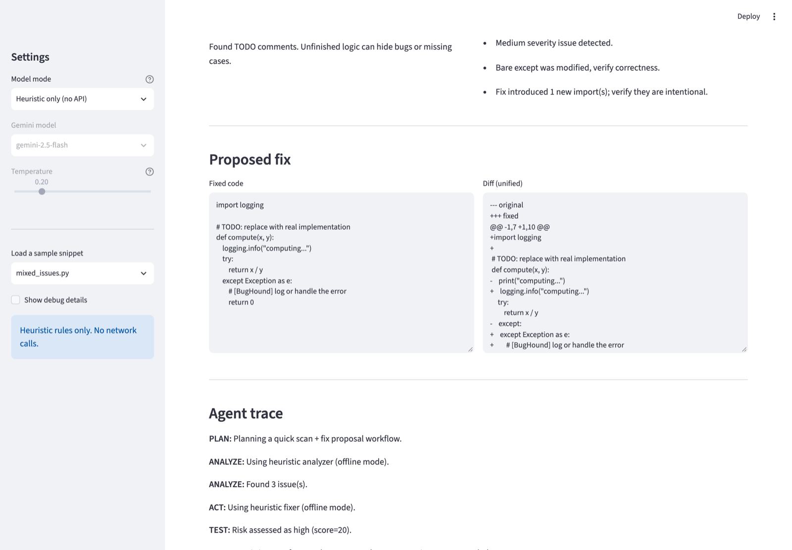

# BugHound — AI-Powered Code Debugging Agent

A Streamlit app and small agent that scans a Python snippet, proposes a fix (Gemini or offline heuristics), and scores the fix's risk before deciding whether it is safe to auto-apply.



> **Coursework.** This is my Unit 9 capstone for CodePath AI110 (Foundations of AI Engineering, Spring 2026). It extends CodePath's [BugHound starter](https://github.com/codepath/ai110-module5tinker-bughound-starter): the agent loop, Streamlit UI, Gemini client, prompts and heuristics come from the starter. My changes are listed below.

**Student:** Sai Sandeep Kumar Vijayarao
**Course:** Foundations of AI Engineering (CodePath AI110), Spring 2026
**Unit:** 9 — Capstone Project

---

## What the starter already had

The starter runs a five-step workflow, **plan → analyze → act → test → reflect**, and already included:

- a `GeminiClient` (google-genai) used by both the analyzer and fixer steps, plus an offline `MockClient`;
- fallback to heuristics when the LLM returns non-JSON, errors out, or returns an empty fix;
- three heuristic checks (bare `except:`, `print()`, `TODO` comments) and a heuristic fixer;
- a rule-based risk assessor (severity deductions, structural-change checks, auto-fix only at "low" risk);
- the Streamlit UI and 8 unit tests.

## Starter vs my changes

Compared with the starter as of 2026-04-27 (commit `5a16038`, the last upstream commit before this repo was created).

| Area | Starter | My change | Where |
|---|---|---|---|
| LLM output validation | Falls back on non-JSON output only | Also falls back when most returned issues have an empty `msg` (6 lines) | `bughound_agent.py` |
| Risk: new imports | Not considered | Each import line the fix adds costs 10 points and adds a reason | `reliability/risk_assessor.py` |
| Auto-fix policy | Auto-fix when level is "low" (score ≥ 75) | Auto-fix only when score ≥ 80 | `reliability/risk_assessor.py` |
| Heuristic mode in the UI | Used `MockClient`, so the "fix" shown was a placeholder comment | Runs the agent with no client, so the real heuristic fixer produces the fix | `bughound_app.py` |
| Tests | 8 unit tests | 4 more covering the new guardrails (12 total) | `tests/test_risk_assessor.py` |
| Evaluation | None | `eval/evaluate.py`: 20 offline checks across detection, fixing, risk scoring and fallback | `eval/` |
| Model card | Template | Filled in: failure modes, reliability rules, improvement proposals | `model_card.md` |
| Tooling | — | `pytest.ini`, GitHub Actions running pytest and the eval harness | `.github/workflows/` |



---

## Architecture

```
+-------------------------------------------------------------+
|                    Streamlit UI (bughound_app.py)            |
|   Sidebar: mode selector, model, temperature, sample loader  |
+------------------------+------------------------------------+
                         | code_snippet (str)
                         v
+-------------------------------------------------------------+
|                  BugHoundAgent (bughound_agent.py)           |
|                                                             |
|  PLAN --> ANALYZE --> ACT --> TEST --> REFLECT              |
|                                                             |
|  ANALYZE:                                                   |
|    +- LLM available? --- YES --> GeminiClient.complete()    |
|    |                               +- parse JSON issues     |
|    |                               +- quality gate ------+  |
|    +- NO / API error / bad JSON / empty msgs ------------+  |
|                        v                                    |
|              _heuristic_analyze()                           |
|                (bare except, print, TODO)                   |
|                                                             |
|  ACT:                                                       |
|    +- issues found + LLM available? -- YES --> GeminiClient |
|    |                                    +- strip fences     |
|    |                                    +- empty? -------+  |
|    +- NO / API error / empty output -------------------+    |
|                        v                                    |
|              _heuristic_fix()                               |
|                                                             |
|  TEST:  assess_risk(original, fixed, issues)                |
|    +- deduct for severity, structural changes, new imports  |
|    +- clamp 0-100, assign level, set should_autofix         |
|                                                             |
|  REFLECT: log decision, return result dict                  |
+------------------------+------------------------------------+
                         | {issues, fixed_code, risk, logs}
                         v
+-------------------------------------------------------------+
|                      Streamlit UI                            |
|   +----------+  +--------------+  +--------------------+    |
|   | Detected |  | Risk Report  |  | Proposed Fix       |    |
|   | Issues   |  | Score/Level  |  | + Unified Diff     |    |
|   +----------+  +--------------+  +--------------------+    |
|                        Agent Trace                          |
+-------------------------------------------------------------+

External dependency (Gemini mode only):
  BugHoundAgent --> GeminiClient --> Google Gemini API
  MockClient used for offline testing (no network calls)
```

**Data flow summary:**  
User pastes code → agent plans → analyzer produces issues list (LLM or heuristic) → fixer rewrites code (LLM or heuristic) → risk assessor scores the diff → agent reflects → UI renders issues, diff, risk report, and trace log.

---

## Setup

### 1. Clone and enter the project

```bash
git clone https://github.com/sandeepvijayarao09/a1110-week9.git
cd a1110-week9
```

### 2. Create a virtual environment

```bash
python -m venv .venv
source .venv/bin/activate   # macOS/Linux
# .venv\Scripts\activate    # Windows
```

### 3. Install dependencies

```bash
pip install -r requirements.txt
```

### 4. (Optional) Add a Gemini API key for LLM mode

```bash
cp .env.example .env
# Edit .env and set GEMINI_API_KEY=your_key_here
```

---

## Running the App

```bash
streamlit run bughound_app.py
```

In the sidebar:
- **Heuristic only (no API)** — fully offline, no key needed
- **Gemini (requires API key)** — uses Gemini for analysis and fix generation

---

## Running Tests

```bash
pytest                    # 12 unit tests, no API key needed
python eval/evaluate.py   # 20-check evaluation harness (offline)
```

Expected output from the evaluation harness:

```
=== 1. Issue Detection (heuristic mode) ===
  [PASS] bare except detected as Reliability/High
  [PASS] print statement detected as Code Quality
  [PASS] mixed: all three heuristics fire (Reliability, Code Quality, Maintainability)
  [PASS] clean code produces no issues
  [PASS] empty input handled gracefully (no crash)

=== 2. Fix Proposal (heuristic mode) ===
  [PASS] bare except fix replaces except: with except Exception
  [PASS] print fix introduces logging.info
  [PASS] print fix adds import logging
  [PASS] clean code is returned unchanged

=== 3. Risk Assessment ===
  [PASS] empty fix is always high risk / no autofix
  [PASS] high-severity issue keeps score <= 60  (score=55)
  [PASS] high-severity issue blocks autofix
  [PASS] new import surfaces in risk reasons
  [PASS] score < 90 when new import added  (score=85)
  [PASS] identical fix with no issues scores 100 and allows autofix

=== 4. LLM Fallback Reliability ===
  [PASS] non-JSON LLM output triggers heuristic fallback
  [PASS] heuristic fallback still detects issues after non-JSON LLM
  [PASS] empty-msg LLM output triggers quality fallback
  [PASS] empty LLM fix falls back to heuristic fixer
  [PASS] heuristic fixer still produces non-empty fix

=============================================
  Results: 20/20 passed  |  0 failed
=============================================
```

---

## Sample Inputs and Outputs

Produced by the agent in heuristic mode (`BugHoundAgent(client=None)`), which is what the app's "Heuristic only" setting runs.

### Input 1 — `sample_code/flaky_try_except.py`

```python
def load_text_file(path):
    try:
        f = open(path, "r")
        data = f.read()
        f.close()
    except:
        return None
    return data
```

**Detected issues (heuristic):**
- Reliability | High — Found a bare `except:`. Catch a specific exception or use `except Exception as e:`.

**Proposed fix (heuristic):**
```python
def load_text_file(path):
    try:
        f = open(path, "r")
        data = f.read()
        f.close()
    except Exception as e:
        # [BugHound] log or handle the error
        return None

    return data
```

**Risk report:** Score: 55 | Level: MEDIUM | Auto-fix: NO  
Reasons: High severity issue detected; bare except was modified, verify correctness.

---

### Input 2 — `sample_code/mixed_issues.py`

```python
# TODO: Replace this with real input validation
def compute_ratio(x, y):
    print("computing ratio...")
    try:
        return x / y
    except:
        return 0
```

**Detected issues (heuristic):**
- Reliability | High — bare `except:`
- Code Quality | Low — print statement
- Maintainability | Medium — TODO comment

**Proposed fix (heuristic):** adds `import logging`, swaps `print` for `logging.info`, and replaces the bare `except:`.

**Risk report:** Score: 20 | Level: HIGH | Auto-fix: NO  
Reasons: High severity (−40), Medium severity (−20), Low severity (−5), bare except modified (−5), 1 new import (−10)

---

### Input 3 — `sample_code/cleanish.py`

```python
import logging

def add(a, b):
    logging.info("Adding two numbers")
    return a + b
```

**Detected issues:** None  
**Fixed code:** Unchanged (agent returns original when no issues found)  
**Risk report:** Score: 100 | Level: LOW | Auto-fix: YES

---

## How AI Was Used During Development

This project was built with GitHub Copilot and Claude Code (Anthropic) assisting throughout.

### Helpful AI suggestion

When designing the LLM output quality validation gate, the assistant suggested checking whether the *majority* of issues had empty `msg` fields rather than requiring all of them to be non-empty. This was the right call — an LLM might return one well-formed issue alongside a few blank ones, and rejecting the entire batch in that case would be too aggressive. The majority threshold (`> len(issues) // 2`) makes the guardrail robust without being overly strict.

### Flawed AI suggestion

An early Copilot suggestion for the heuristic fixer used `str.replace("except:", "except Exception as e:")` (plain string replace). This was wrong: it would have matched `except:` inside string literals, comments, or docstrings. The correct approach — already in the starter — uses `re.sub` with a word-boundary pattern (`\bexcept\s*:\s*`) to match only actual exception clauses. The Copilot suggestion was rejected and the regex approach was preserved.

---

## System Limitations and Future Improvements

### Current limitations

1. **Heuristics are keyword-based** — the bare `except:` regex fires on any line matching the pattern, including inside string literals or multiline comments.
2. **Fixer is global, not targeted** — `print(` is replaced everywhere in the file, including in `if __name__ == "__main__":` blocks where print is appropriate.
3. **Risk scoring is additive and linear** — two Medium issues score the same as one High issue (both −40 net), which does not reflect actual risk distribution well.
4. **No structural AST analysis** — the system cannot distinguish a safe cosmetic change from one that alters control flow; it relies on surface-level line counts and string checks.
5. **Single-file scope** — BugHound cannot reason about cross-file dependencies, so it may propose fixes that break callers in other modules.

### Proposed improvements

1. **Parse with `ast` before heuristic checks** — walking the AST would eliminate false positives from string literals and enable detecting subtler issues (mutable default arguments, unreachable code, missing `return` in all branches).
2. **Targeted fix application** — identify the exact AST node containing the issue and apply the fix only to that node instead of rewriting the whole file.
3. **Tiered risk model** — multiply severity weights rather than adding them; two Medium issues should not equal one High in actual risk.
4. **Sensitive-operation keyword block** — if the code contains words like `password`, `token`, `payment`, or `delete`, unconditionally block auto-fix regardless of score.
5. **Issue count cap on LLM output** — if the LLM returns more than 8 issues, treat the response as over-sensitive and fall back to heuristics.

---

## License

My changes are [MIT](LICENSE). The starter code belongs to CodePath.
